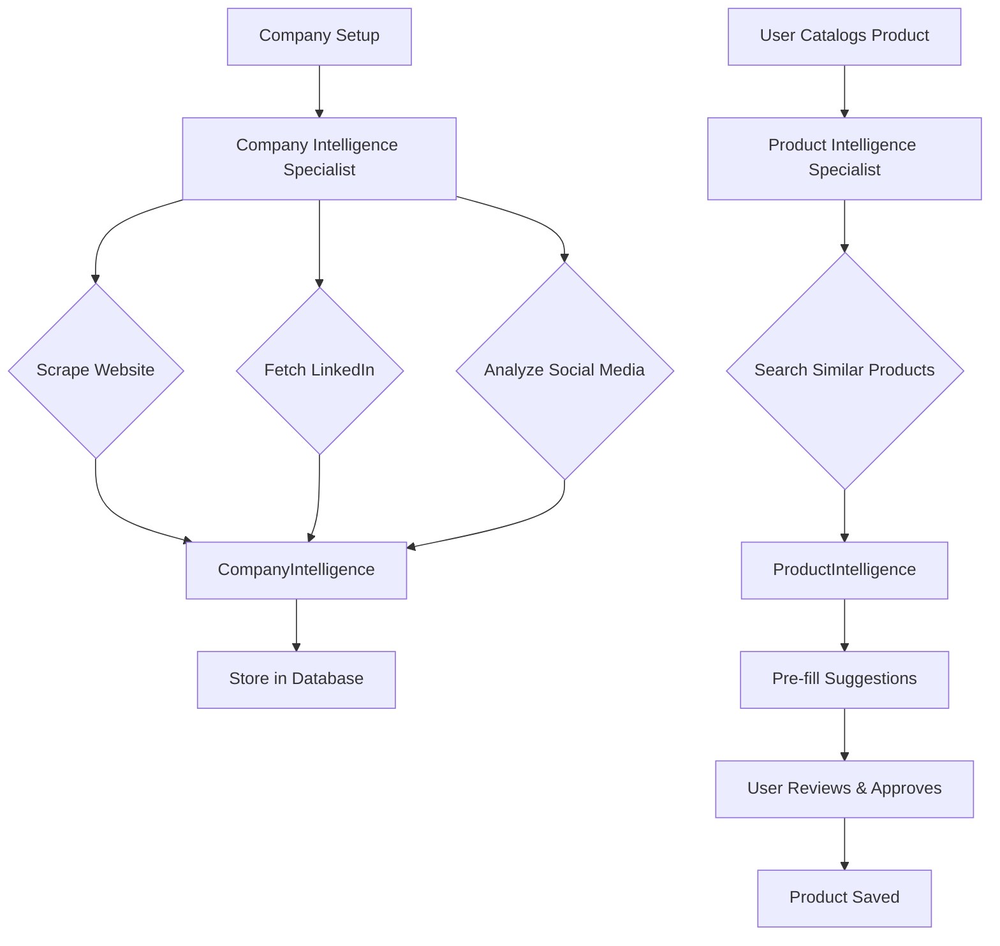

# Intelligent Product Onboarding: Auto-Research & Multi-Dimensional Data Architecture

**Date:** 2025-10-23
**Status:** Design Specification
**Context:** AI-driven product onboarding with minimal user input, supporting complex business models and product variants

---

## Executive Summary

**Core Principle:** **Auto-discover everything possible, minimize user input to absolute essentials.**

**Current Problem:**
- Relying heavily on user input for data we can auto-discover online
- No support for B2B vs B2C vs D2C business model differences
- No handling of product variants (size, color, industry-specific configurations)
- No multi-industry targeting (same product marketed to different sectors)
- Linear data model cannot represent combinatorial product complexity

**Solution:**
1. **Auto-Research Intelligence Layer** - AI agents scrape web, discover company/brand/product data before asking users
2. **Multi-Dimensional Data Model** - Support ProductFamily (parent) → Product variants (children), multiple industries, customer segments
3. **Business Model Awareness** - B2B vs B2C affects tone, messaging, sales channels, content strategy
4. **Progressive Enhancement** - Phase 0 (Auto-discover) → Phase 1 (Core) → Phase 2 (Marketing) → Phase 3 (Optimization)

**Impact:** Reduce user onboarding time by 60%, improve marketing quality through intelligence automation, support complex real-world scenarios.

---

## Part I: Auto-Research Intelligence Architecture

### Why Auto-Research?

**Market Reality (2025):**
- 65% of enterprises use web scraping for AI/ML projects
- 60% of marketing teams scrape for brand sentiment and competitor analysis
- AI-driven web scraping market: $886M (2025) → $4.37B (2035)
- Price intelligence refreshes catalogs hourly (19.8% CAGR growth)

**What We Can Auto-Discover:**
- Company website → Mission, values, industry, business model
- LinkedIn company page → Industry, size, offerings, voice
- Social media (Instagram, Facebook) → Brand voice, aesthetic, target audience
- Product catalogs (own website, marketplaces) → Existing products, pricing patterns
- Competitor websites → Similar products, price positioning, features
- Reviews/ratings → Customer sentiment, pain points, benefits
- Industry classification → NAICS codes, verticals served

**What We Still Need User Input:**
- New products not yet online
- Proprietary competitive advantages (trade secrets)
- Real-time inventory (stock levels)
- Current pricing (if different from historical)
- Strategic intent (new market expansion)

---

### Phase 0: Auto-Discovery (Before User Input)

**Triggered:** When company/brand first connects to AutifyME

**Process:**
```
1. User provides: Company name + website URL (one-time setup)
   ↓
2. Company Intelligence Specialist activates
   ↓
3. Web research conducted automatically:
   - Scrape company website (About, Products, Services pages)
   - Fetch LinkedIn company profile
   - Scan Instagram, Facebook business profiles
   - Search Google for company mentions, reviews
   - Identify competitors (similar offerings)
   ↓
4. Build CompanyIntelligence profile:
   - Business model (B2B, B2C, D2C, mixed)
   - Industries served (NAICS classification)
   - Brand voice (formal, casual, luxury, playful)
   - Target audience(s) (demographics, psychographics)
   - Existing product catalog (if available online)
   - Pricing patterns (budget, mid-range, premium)
   - Competitors (top 3-5 similar companies)
   ↓
5. Store in database, use as context for ALL future cataloging
```

**Result:** When user catalogs first product, system already knows company context → smarter defaults, better suggestions.

---

### Auto-Research Specialists

#### 1. Company Intelligence Specialist (NEW)

**Responsibilities:**
- Scrape company website for about, mission, products
- Fetch LinkedIn company profile (industry, size, description)
- Analyze social media profiles (Instagram, Facebook) for brand voice
- Classify business model (B2B, B2C, D2C, mixed)
- Map industries served (NAICS taxonomy)
- Identify target audience segments

**Tools:**
- `scrape_website(url)` - Extract structured data from website
- `fetch_linkedin_company(company_name)` - Get LinkedIn profile
- `analyze_social_media(brand_name)` - Scan Instagram/Facebook
- `classify_business_model(description, products)` - Infer B2B/B2C/D2C
- `map_naics_industry(description, products)` - NAICS classification
- `extract_brand_voice(content, social_posts)` - Tone analysis

**Output Schema:**
```python
class CompanyIntelligence(BaseModel):
    """Auto-discovered company intelligence from web sources."""
    # Basic info
    name: str
    website: str
    description: str
    mission: str | None
    founded_year: int | None

    # Business model
    business_models: list[Literal["B2B", "B2C", "D2C"]]
    # Examples: ["B2C"], ["B2B"], ["B2B", "B2C"] for mixed

    # Industries served
    industries: list[Industry]  # NAICS-based classification
    primary_industry: Industry

    # Brand intelligence
    brand_voice: BrandVoice
    target_audiences: list[TargetAudience]

    # Competitive context
    competitors: list[CompetitorCompany]
    price_positioning: Literal["budget", "mid-range", "premium"]

    # Existing catalog (if found online)
    existing_products: list[DiscoveredProduct] | None

    # Metadata
    confidence_score: float  # How confident are we in this data?
    last_updated: datetime
    sources: list[str]  # URLs scraped
```

**Usage Flow:**
```
Admin: "Setup company: Fabindia, https://fabindia.com"

System:
→ Company Intelligence Specialist activates
→ Scrapes fabindia.com (About, Collections, Store pages)
→ Finds: "Ethnic wear, home décor, organic products"
→ Fetches LinkedIn: "Retail, 10,001+ employees, Indian crafts"
→ Scans Instagram: @fabindiaofficial - 389K followers, lifestyle imagery
→ Analyzes: Business model = B2C + D2C (own stores + online)
→ Industries: Apparel & Accessories (NAICS 315), Home Furnishings (NAICS 314)
→ Brand voice: "Traditional yet contemporary, sustainability-focused, premium casual"
→ Target audience: "Urban Indians 25-45, middle-to-upper class, value craftsmanship"
→ Competitors: [Good Earth, Anokhi, Khadi & Co]
→ Price positioning: "mid-range to premium"
→ Existing products: [Kurtas, Bedsheets, Cushion covers] (scraped from website)

CompanyIntelligence stored ✅

Now when user catalogs first Kurta:
- System pre-fills brand="Fabindia"
- Suggests category="Apparel > Ethnic Wear > Kurtas"
- Sets default tone="traditional-contemporary"
- Knows target_audience="Urban 25-45, values craftsmanship"
- Can compare pricing to competitors automatically
```

---

#### 2. Brand Research Specialist (NEW)

**Responsibilities:**
- Deep-dive into brand positioning, values, aesthetic
- Analyze visual brand identity (colors, photography style)
- Extract messaging themes from marketing materials
- Identify brand differentiators

**Tools:**
- `analyze_brand_positioning(website, social_media)` - Extract positioning
- `extract_visual_identity(images)` - Analyze color palette, style
- `identify_brand_themes(content)` - Messaging patterns
- `compare_to_competitors(brand, competitors)` - Differentiation analysis

**Output:**
```python
class BrandIntelligence(BaseModel):
    """Deep brand research findings."""
    positioning_statement: str
    core_values: list[str]
    visual_identity: VisualIdentity
    messaging_themes: list[str]
    differentiators: list[str]
    brand_archetype: Literal["innovator", "caregiver", "rebel", "sage", "explorer", ...]
```

---

#### 3. Product Intelligence Specialist (NEW)

**Responsibilities:**
- Research product when user provides name/description
- Find similar products online (competitors, marketplaces)
- Extract common attributes (category, materials, use cases)
- Determine price positioning vs market

**Tools:**
- `search_similar_products(product_name, description)` - Web search
- `scrape_product_pages(urls)` - Extract structured data
- `classify_product_category(name, description, images)` - Auto-categorize
- `analyze_price_positioning(price, similar_products)` - Price tier
- `extract_common_attributes(similar_products)` - Variants, materials, features

**Output:**
```python
class ProductIntelligence(BaseModel):
    """Auto-discovered product intelligence."""
    suggested_category: str
    suggested_tags: list[str]
    similar_products: list[CompetitorProduct]
    common_variants: list[VariantAxis]  # e.g., ["size", "color"] found in similar products
    typical_price_range: PriceRange
    price_tier: Literal["budget", "mid-range", "premium"]
    common_use_cases: list[str]
```

**Usage Flow:**
```
User: [Sends image of blue kurta]

System:
→ Image analysis: "Blue printed kurta"
→ Product Intelligence Specialist activates
→ Searches: "blue printed kurta online"
→ Finds similar products: Amazon (₹799), Myntra (₹1299), Ajio (₹1899)
→ Analyzes: Common variants = [size (S,M,L,XL,XXL), color (multiple)]
→ Price range: ₹799 - ₹2499, user's ₹1299 = mid-range
→ Common tags: ["ethnic wear", "kurta", "cotton", "festive", "casual"]
→ Suggests category: "Apparel > Women > Ethnic Wear > Kurtas"

When asking user for details:
"I see a blue kurta. Based on similar products, I've suggested:
- Category: Ethnic Wear > Kurtas
- Tags: ethnic wear, kurta, festive, casual
- Your price ₹1299 is mid-range for this category
- Common sizes: S, M, L, XL, XXL - which do you have?
Do these look right?"
```

---

#### 4. Industry Classifier Specialist (NEW)

**Responsibilities:**
- Map company products to NAICS industry codes
- Identify multi-industry targeting opportunities
- Suggest industry-specific messaging angles

**Tools:**
- `classify_naics(description, products)` - NAICS 2022 classification
- `identify_cross_industry_potential(product)` - Multi-industry opportunities
- `generate_industry_specific_messaging(product, industry)` - Tailored copy

**Output:**
```python
class IndustryClassification(BaseModel):
    """NAICS industry classification."""
    primary_naics: NAICSCode
    secondary_naics: list[NAICSCode]
    industry_labels: list[str]  # Human-readable
    cross_industry_potential: dict[str, str]  # Industry → use case
```

**Example:**
```
Product: "Stainless Steel Water Bottle"

Industry Classifier analyzes:
→ Primary NAICS: 332439 (Metal Container Manufacturing)
→ Cross-industry potential:
  - Healthcare (hydration for nurses, doctors)
  - Sports & Fitness (gym-goers, athletes)
  - Corporate (office use, branded gifts)
  - Education (students, schools)
  - Outdoor Recreation (hikers, campers)

Suggests: Marketing this product to 5 different industries with tailored messaging
```

---

### Auto-Research Data Flow



---

## Part II: Business Model Complexity

### B2B vs B2C vs D2C: Critical Differences

| Dimension | B2B | B2C | D2C |
|-----------|-----|-----|-----|
| **Decision Makers** | Committees, procurement | Individual consumers | Individual consumers |
| **Purchase Cycle** | Long (weeks-months) | Short (minutes-days) | Short (minutes-days) |
| **Content Tone** | Formal, authoritative, ROI-focused | Emotional, relatable, aspirational | Brand-story focused, authentic |
| **Messaging Focus** | Solutions, efficiency, cost savings | Benefits, emotions, lifestyle | Direct relationship, no middlemen |
| **Marketing Channels** | LinkedIn, whitepapers, trade shows | Instagram, Facebook, YouTube | Instagram, email, own website |
| **Pricing Strategy** | Volume discounts, contracts, negotiated | Fixed, promotional sales | Fixed, subscription, bundles |
| **Product Focus** | Features, specs, certifications, ROI | Benefits, emotions, convenience | Brand values, sustainability, quality |
| **Content Examples** | Case studies, ROI calculators, technical docs | Lifestyle imagery, testimonials, FOMO | Behind-the-scenes, founder story, craftsmanship |

**2025 Trend:** B2B content becoming more human and less robotic while maintaining credibility. Short-form video performing well across both B2B and B2C.

---

### Business Model Impact on Product Data

**Example: Office Chair**

**B2B Context:**
```python
target_audience: "Facility managers, procurement officers, 50-500 employee companies"
use_cases: ["Office seating", "Conference rooms", "Co-working spaces"]
usp: "Ergonomic certification, 10-year warranty, bulk pricing available"
benefits: ["Reduce employee back pain → less sick days", "Increase productivity", "Lower long-term costs"]
content_tone: "professional"
sales_channels: ["B2B marketplace", "Direct sales team", "LinkedIn ads"]
pricing_display: "Starting at ₹12,000 per unit (volume discounts for 10+)"
```

**B2C Context (same product):**
```python
target_audience: "Home office workers, remote professionals, 25-45 years old"
use_cases: ["Home office", "Study room", "Gaming setup"]
usp: "Doctor-recommended ergonomics, sleek design, easy assembly"
benefits: ["Work pain-free all day", "Look professional on video calls", "Upgrade your workspace"]
content_tone: "casual"
sales_channels: ["Instagram shop", "Website", "Amazon"]
pricing_display: "₹14,999 (Free shipping, 30-day trial)"
```

**Same product, completely different marketing!**

---

### Data Model: Multi-Segment Support

```python
class CustomerSegment(BaseModel):
    """Represents a customer segment for targeted marketing."""
    segment_type: Literal["B2B", "B2C", "D2C"]
    target_audience: str
    use_cases: list[str]
    benefits_focus: list[str]
    content_tone: Literal["professional", "casual", "luxury", "playful", "traditional"]
    marketing_channels: list[str]
    pricing_strategy: str

class ProductMarketing(BaseModel):
    """Marketing strategy supporting multiple customer segments."""
    # Default segment (if only one)
    primary_segment: CustomerSegment

    # Multi-segment support
    segments: list[CustomerSegment] | None
    # Example: B2B + B2C for office chair

    # Shared marketing data
    usp: str
    brand_story: str | None

    # FAB framework (can vary per segment)
    features: list[str]  # Shared features
    segment_specific_messaging: dict[str, SegmentMessaging] | None
```

---

## Part III: Product Variant Architecture

### The Combinatorial Challenge

**Example 1: Apparel (T-Shirt)**
- Sizes: XS, S, M, L, XL, XXL (6 options)
- Colors: Red, Blue, Green, Black, White (5 options)
- **Total SKUs: 6 × 5 = 30 variants**

**Example 2: Industrial Chemical**
- Purity grades: 90%, 95%, 99%, 99.9% (4 options)
- Package sizes: 1L, 5L, 25L, 200L (4 options)
- Industries: Pharma, Food, Industrial (3 markets)
- **Total combinations: 4 × 4 = 16 product SKUs**
- **Marketing variations: 16 SKUs × 3 industries = 48 content pieces**

**Example 3: Software SaaS**
- Tiers: Basic, Pro, Enterprise (3 options)
- Billing: Monthly, Annual (2 options)
- User segments: Freelancer, Agency, Corporate (3 segments)
- Industries: Tech, Healthcare, Finance, Retail (4 verticals)
- **Pricing combinations: 3 × 2 = 6**
- **Marketing messaging: 6 × 3 × 4 = 72 variations**

---

### Schema.org ProductGroup Pattern

**Google's Standard (2025):**

```json
{
  "@context": "https://schema.org",
  "@type": "ProductGroup",
  "name": "Nike Air Max Sneakers",
  "productGroupID": "AIR-MAX-001",
  "variesBy": ["https://schema.org/color", "https://schema.org/size"],
  "hasVariant": [
    {
      "@type": "Product",
      "sku": "AIR-MAX-001-RED-10",
      "name": "Nike Air Max - Red, Size 10",
      "color": "Red",
      "size": "10",
      "offers": {
        "@type": "Offer",
        "price": "9999",
        "priceCurrency": "INR"
      }
    },
    {
      "@type": "Product",
      "sku": "AIR-MAX-001-BLU-10",
      "name": "Nike Air Max - Blue, Size 10",
      "color": "Blue",
      "size": "10",
      "offers": {
        "@type": "Offer",
        "price": "9999",
        "priceCurrency": "INR"
      }
    }
  ]
}
```

**Benefits:**
- Groups variants for Google Search rich results
- Shows color/size options in search snippets
- Scales to thousands of variants efficiently
- Supports distinct URLs per variant OR single page with selectors

---

### Data Model: Product Family & Variants

```python
class VariantAxis(BaseModel):
    """Dimension along which products vary."""
    name: Literal["size", "color", "material", "grade", "package_size", "tier", "billing_cycle"]
    values: list[str]
    # Example: name="size", values=["S", "M", "L", "XL"]

class ProductFamily(BaseModel):
    """
    Parent product concept representing a group of variants.

    Example: "Nike Air Max Sneaker" (concept)
    Variants: Individual SKUs per size/color combination
    """
    id: UUID
    product_group_id: str  # For schema.org ProductGroup
    name: str  # "Nike Air Max Sneaker"
    description: str  # Base description shared across variants
    brand: str

    # Categorization
    category: str
    google_product_category: str | None
    tags: list[str]

    # Variant configuration
    varies_by: list[VariantAxis]
    # Example: [
    #   {name: "size", values: ["S", "M", "L"]},
    #   {name: "color", values: ["Red", "Blue", "Green"]}
    # ]
    # This generates 3 × 3 = 9 product variants automatically

    # Shared attributes (apply to all variants)
    base_price: float  # Price before variant adjustments
    priceCurrency: str
    material: str | None

    # Multi-industry support
    industries: list[Industry]
    # Example: ["Healthcare", "Sports", "Corporate"] for water bottle

    # Multi-segment support
    customer_segments: list[CustomerSegment]
    # Example: [B2B, B2C] for office chair

    # Marketing intelligence (shared)
    marketing: ProductMarketing

    # Visual assets (shared or variant-specific)
    base_images: list[ProductImage]  # Generic product images
    variant_images: dict[str, list[ProductImage]] | None
    # Example: {"Red": [red_lifestyle.jpg], "Blue": [blue_lifestyle.jpg]}

    # Metadata
    created_at: datetime
    updated_at: datetime

class Product(BaseModel):
    """
    Specific product variant (individual SKU).

    Example: "Nike Air Max - Red, Size 10"
    """
    id: UUID
    sku: str  # Unique: "AIR-MAX-001-RED-10"
    product_family_id: UUID  # References ProductFamily

    # Variant-specific attributes
    variant_attributes: dict[str, str]
    # Example: {"size": "10", "color": "Red"}

    # Override name if needed (usually auto-generated from family + variants)
    name: str | None  # "Nike Air Max - Red, Size 10"

    # Variant-specific overrides (if pricing/availability differs)
    price: float | None  # Override base_price if variant costs more
    availability: Literal["in stock", "out of stock", "preorder", "discontinued"]
    stock_quantity: int | None

    # Variant-specific images (if different from base_images)
    images: list[ProductImage] | None

    # Product page URL
    link: str  # Constructed: domain.com/products/nike-air-max-red-size-10

    # Metadata
    is_primary_variant: bool  # Featured variant (e.g., most popular color)
    created_at: datetime

# Helper function to generate variants automatically
def generate_variants(product_family: ProductFamily) -> list[Product]:
    """
    Auto-generate all variant combinations from ProductFamily.varies_by.

    Example:
    varies_by = [
        {name: "size", values: ["S", "M", "L"]},
        {name: "color", values: ["Red", "Blue"]}
    ]
    → Generates 6 Products: S-Red, S-Blue, M-Red, M-Blue, L-Red, L-Blue
    """
    import itertools

    # Extract all variant dimensions
    axes = [(axis.name, axis.values) for axis in product_family.varies_by]

    # Generate cartesian product (all combinations)
    combinations = list(itertools.product(*[values for name, values in axes]))

    products = []
    for combo in combinations:
        # Build variant_attributes dict
        variant_attrs = {axes[i][0]: combo[i] for i in range(len(combo))}

        # Generate SKU
        sku = generate_sku(product_family.product_group_id, variant_attrs)

        # Generate name
        variant_name = generate_variant_name(product_family.name, variant_attrs)

        # Create Product
        product = Product(
            sku=sku,
            product_family_id=product_family.id,
            variant_attributes=variant_attrs,
            name=variant_name,
            price=product_family.base_price,  # Can be overridden later
            availability="in stock",  # Default
            link=generate_product_link(sku),
            is_primary_variant=False  # Set one as primary manually
        )
        products.append(product)

    return products

def generate_sku(product_group_id: str, variant_attrs: dict) -> str:
    """Generate SKU from product group ID + variant attributes."""
    # Example: "AIR-MAX-001" + {"color": "Red", "size": "10"}
    # → "AIR-MAX-001-RED-10"
    suffix = "-".join(str(v).upper().replace(" ", "-") for v in variant_attrs.values())
    return f"{product_group_id}-{suffix}"

def generate_variant_name(base_name: str, variant_attrs: dict) -> str:
    """Generate variant name from base name + attributes."""
    # Example: "Nike Air Max" + {"color": "Red", "size": "10"}
    # → "Nike Air Max - Red, Size 10"
    attrs_str = ", ".join(f"{k.title()} {v}" for k, v in variant_attrs.items())
    return f"{base_name} - {attrs_str}"
```

---

### Variant Management UI Flow

**User Experience:**

```
User: "I want to catalog Nike Air Max sneakers"

System: "Great! Does this product have variants? (yes/no)"

User: "Yes"

System: "What does it vary by? (Select all that apply)
[ ] Size
[ ] Color
[ ] Material
[ ] Other"

User: [Selects Size, Color]

System: "What sizes are available?"
User: "8, 9, 10, 11, 12"

System: "What colors?"
User: "Red, Blue, Black, White"

System: "Got it! This will create 5 sizes × 4 colors = 20 product variants.
Base price for all variants?"
User: "9999 INR"

System: "Do any variants have different pricing? (yes/no)"
User: "No"

System:
✅ Created ProductFamily: "Nike Air Max Sneaker"
✅ Generated 20 variants automatically
✅ All variants priced at ₹9999
✅ Stock status: All in stock (update individual variants if needed)

Want to upload variant-specific images? (yes/later)
```

---

## Part IV: Industry-Specific & Multi-Segment Marketing

### Same Product, Multiple Industries

**Example: Stainless Steel Water Bottle**

```python
product_family = ProductFamily(
    name="Stainless Steel Water Bottle - 1L",
    base_price=499.00,
    varies_by=[
        VariantAxis(name="color", values=["Silver", "Black", "Blue", "Pink"])
    ],

    # Multi-industry targeting
    industries=[
        {
            "name": "Healthcare",
            "naics": "621",
            "use_cases": ["Nurse hydration", "Doctor on-call", "Long shifts"],
            "messaging_angle": "Stay hydrated through 12-hour shifts. BPA-free, easy to sanitize."
        },
        {
            "name": "Sports & Fitness",
            "naics": "713",
            "use_cases": ["Gym workouts", "Running", "Cycling"],
            "messaging_angle": "Keep cold for 24 hours. Sweat-proof grip for intense workouts."
        },
        {
            "name": "Corporate",
            "naics": "541",
            "use_cases": ["Office desk", "Client gifts", "Branded merchandise"],
            "messaging_angle": "Professional, sustainable desk accessory. Customizable with logo."
        },
        {
            "name": "Education",
            "naics": "611",
            "use_cases": ["Student hydration", "School canteens", "University gifts"],
            "messaging_angle": "Durable for daily student use. Eco-friendly alternative to plastic."
        }
    ],

    # Multi-segment (B2B + B2C)
    customer_segments=[
        CustomerSegment(
            segment_type="B2C",
            target_audience="Health-conscious individuals 25-45",
            benefits_focus=["Stay hydrated", "Reduce plastic waste", "Stylish accessory"],
            content_tone="casual",
            pricing_strategy="₹499 per bottle"
        ),
        CustomerSegment(
            segment_type="B2B",
            target_audience="Corporate buyers, HR managers",
            benefits_focus=["Employee wellness program", "Branded corporate gifts", "Sustainability initiative"],
            content_tone="professional",
            pricing_strategy="₹399 per bottle (bulk orders 50+)"
        )
    ]
)
```

**Marketing Content Generation:**

```
User: "Generate Instagram post for this water bottle"

System: "Which industry should I target?
1. Healthcare
2. Sports & Fitness
3. Corporate
4. Education
5. General (multi-industry)"

User: "Sports & Fitness"

Instagram Specialist generates:
"Crush your workout goals 💪🏋️
Stay hydrated with our insulated water bottle - keeps drinks cold for 24 hours!
Sweat-proof grip, BPA-free, planet-friendly.

Perfect for:
🏃 Runners
🚴 Cyclists
🏋️ Gym warriors

Shop now! Link in bio 🔗
#FitnessGoals #StayHydrated #WorkoutEssentials #GymLife #BottleGoals"

[DALL-E 3 image: Athletic person drinking from bottle at gym]
```

---

## Part V: Complete Data Architecture

### Core Entities & Relationships

```
Company (1)
  ├─ CompanyIntelligence (1) [auto-discovered]
  └─ ProductFamily (N)
      ├─ Product (N) [variants]
      ├─ Industry (M:N) [targets multiple industries]
      ├─ CustomerSegment (M:N) [B2B, B2C, D2C]
      └─ UseCase (M:N) [multiple applications]
```

### Database Schema

```sql
-- Company intelligence (auto-discovered)
CREATE TABLE company_intelligence (
    id UUID PRIMARY KEY,
    company_id TEXT REFERENCES companies(id),

    -- Business model
    business_models TEXT[] NOT NULL,  -- {'B2B', 'B2C', 'D2C'}

    -- Industries (NAICS)
    primary_naics_code TEXT,
    industries JSONB,  -- Array of {code, label, description}

    -- Brand intelligence
    brand_voice TEXT,  -- 'formal', 'casual', 'luxury', 'playful', 'traditional'
    target_audiences JSONB,  -- Array of audience profiles

    -- Competitive
    competitors JSONB,  -- Array of {name, website, positioning}
    price_positioning TEXT,  -- 'budget', 'mid-range', 'premium'

    -- Discovery metadata
    confidence_score FLOAT,
    sources TEXT[],  -- URLs scraped
    last_updated TIMESTAMP DEFAULT NOW(),

    UNIQUE(company_id)
);

-- Product families (parent concepts)
CREATE TABLE product_families (
    id UUID PRIMARY KEY DEFAULT gen_random_uuid(),
    company_id TEXT NOT NULL,
    product_group_id TEXT NOT NULL UNIQUE,  -- For schema.org

    -- Basic info
    name TEXT NOT NULL,
    description TEXT,
    brand TEXT NOT NULL,
    category TEXT,
    google_product_category TEXT,
    tags TEXT[],

    -- Variant configuration
    varies_by JSONB,  -- Array of {name, values[]}
    -- Example: [{"name": "size", "values": ["S", "M", "L"]}, {"name": "color", "values": ["Red", "Blue"]}]

    -- Pricing
    base_price DECIMAL NOT NULL,
    price_currency TEXT NOT NULL DEFAULT 'INR',

    -- Shared attributes
    material TEXT,
    condition TEXT DEFAULT 'new',

    -- Marketing
    marketing_data JSONB,  -- ProductMarketing schema

    -- Metadata
    created_at TIMESTAMP DEFAULT NOW(),
    updated_at TIMESTAMP DEFAULT NOW()
);

-- Product variants (individual SKUs)
CREATE TABLE products (
    id UUID PRIMARY KEY DEFAULT gen_random_uuid(),
    product_family_id UUID REFERENCES product_families(id) ON DELETE CASCADE,
    sku TEXT NOT NULL UNIQUE,

    -- Variant attributes
    variant_attributes JSONB NOT NULL,
    -- Example: {"size": "M", "color": "Red"}

    -- Basic info (can override family)
    name TEXT,

    -- Pricing (can override family)
    price DECIMAL,
    sale_price DECIMAL,
    sale_price_effective_date TEXT,  -- ISO 8601 interval

    -- Inventory
    availability TEXT NOT NULL DEFAULT 'in stock',
    stock_quantity INTEGER,
    low_stock_threshold INTEGER DEFAULT 5,

    -- URLs
    link TEXT,

    -- Metadata
    is_primary_variant BOOLEAN DEFAULT FALSE,
    created_at TIMESTAMP DEFAULT NOW(),
    updated_at TIMESTAMP DEFAULT NOW()
);

CREATE INDEX idx_products_family ON products(product_family_id);
CREATE INDEX idx_products_sku ON products(sku);

-- Product images (can be family-level or variant-specific)
CREATE TABLE product_images (
    id UUID PRIMARY KEY DEFAULT gen_random_uuid(),

    -- Belongs to either family or specific variant
    product_family_id UUID REFERENCES product_families(id) ON DELETE CASCADE,
    product_id UUID REFERENCES products(id) ON DELETE CASCADE,
    CHECK ((product_family_id IS NOT NULL AND product_id IS NULL) OR
           (product_family_id IS NULL AND product_id IS NOT NULL)),

    url TEXT NOT NULL,
    type TEXT NOT NULL,  -- 'product_shot', 'lifestyle', 'detail', 'packaging'
    angle TEXT,  -- 'front', 'back', 'side', 'top', 'closeup'
    is_primary BOOLEAN DEFAULT FALSE,
    alt_text TEXT,
    metadata JSONB
);

-- Industries (NAICS taxonomy)
CREATE TABLE industries (
    naics_code TEXT PRIMARY KEY,  -- '541' for Professional Services
    label TEXT NOT NULL,  -- 'Professional, Scientific, and Technical Services'
    description TEXT,
    parent_code TEXT REFERENCES industries(naics_code)
);

-- Product family → Industries (M:N)
CREATE TABLE product_family_industries (
    product_family_id UUID REFERENCES product_families(id) ON DELETE CASCADE,
    naics_code TEXT REFERENCES industries(naics_code),

    -- Industry-specific marketing
    use_cases TEXT[],
    messaging_angle TEXT,

    PRIMARY KEY (product_family_id, naics_code)
);

-- Customer segments (B2B, B2C, D2C)
CREATE TABLE customer_segments (
    id UUID PRIMARY KEY DEFAULT gen_random_uuid(),
    product_family_id UUID REFERENCES product_families(id) ON DELETE CASCADE,

    segment_type TEXT NOT NULL,  -- 'B2B', 'B2C', 'D2C'
    target_audience TEXT,
    use_cases TEXT[],
    benefits_focus TEXT[],
    content_tone TEXT,  -- 'professional', 'casual', 'luxury', 'playful'
    marketing_channels TEXT[],
    pricing_strategy TEXT
);

-- Product intelligence (auto-discovered per product)
CREATE TABLE product_intelligence (
    id UUID PRIMARY KEY DEFAULT gen_random_uuid(),
    product_family_id UUID REFERENCES product_families(id),

    -- Auto-discovered data
    suggested_category TEXT,
    suggested_tags TEXT[],
    similar_products JSONB,  -- Competitor products
    typical_price_range JSONB,  -- {min, max, currency}
    price_tier TEXT,  -- 'budget', 'mid-range', 'premium'
    common_use_cases TEXT[],
    common_variants JSONB,  -- Variant axes found in similar products

    -- Discovery metadata
    confidence_score FLOAT,
    sources TEXT[],
    discovered_at TIMESTAMP DEFAULT NOW(),

    UNIQUE(product_family_id)
);
```

---

## Part VI: Intelligent Onboarding Flow

### Phase 0: Auto-Discovery (One-Time Company Setup)

```
Admin: "Setup company"

System: "What's your company name?"
Admin: "Fabindia"

System: "What's your website?"
Admin: "https://fabindia.com"

System: "Great! Let me research Fabindia automatically..."

[Company Intelligence Specialist activates]
[1-2 minutes of web scraping]

System: "✅ Company research complete! Here's what I found:

Business Model: B2C + D2C (Retail stores + Online)
Industries: Apparel, Home Furnishings, Organic Products
Brand Voice: Traditional yet contemporary, sustainability-focused
Target Audience: Urban Indians 25-45, value craftsmanship, middle-to-upper class
Price Positioning: Mid-range to premium
Competitors: Good Earth, Anokhi, Khadi & Co

Does this look accurate? (yes/edit)"

Admin: "Yes"

System: "Perfect! This context will help me catalog your products intelligently.
Ready to add your first product?"
```

---

### Phase 1: Intelligent Product Cataloging

**Scenario: User catalogs a kurta**

```
User: [Sends 3 images of blue kurta]

System:
[Image analysis: Blue, kurta style, ethnic wear]
[Product Intelligence Specialist: Searches similar kurtas online]

System: "Thanks! I see a blue kurta 👗

Based on Fabindia's style and similar products online, I've pre-filled:
- Brand: Fabindia ✅
- Category: Apparel > Women > Ethnic Wear > Kurtas ✅
- Suggested tags: ethnic wear, kurta, festive, traditional ✅
- Price tier: Mid-range (similar kurtas: ₹799-₹2499) ✅

What's the price for this kurta?"
User: "1299"

System: "Perfect! ₹1299 is mid-range for this category.

Does this kurta have variants? (yes/no)"
User: "Yes"

System: "What varies? (Select all)
[ ] Size
[ ] Color
[ ] Material
[ ] Other"
User: [Selects Size, Color]

System: "What sizes?"
User: "S, M, L, XL, XXL"

System: "What colors?"
User: "Blue, Red, Green"

System: "Got it! This creates 5 sizes × 3 colors = 15 variants.

All variants same price? (yes/no)"
User: "Yes"

System: "Creating product family and variants..."

✅ Created: Blue Printed Kurta (Family)
✅ Generated: 15 variants (S-Blue, S-Red, S-Green, M-Blue, ...)
✅ All priced at ₹1299
✅ Category: Ethnic Wear > Kurtas
✅ Tags: ethnic wear, kurta, festive, traditional, handloom

Want to enhance marketing now or later? (now/later)"
User: "Now"

[Proceeds to Phase 2]
```

---

### Phase 2: Marketing Enhancement (Auto-Research + Minimal Input)

```
System: "Let me research your market positioning..."

[Product Intelligence Specialist analyzes competitors]

System: "I found 5 similar kurtas:
- Competitor A: ₹799 (machine-made)
- Competitor B: ₹1299 (similar quality)
- Competitor C: ₹2499 (designer, silk)

Your kurta at ₹1299:
✅ Mid-range pricing
✅ Competes on craftsmanship vs mass-market
✅ More affordable than designer brands

Based on Fabindia's brand research, I suggest:

Target Audience: Urban women 25-45, professionals, appreciate traditional craftsmanship
Use Cases: Festive occasions, Office wear (if cotton), Cultural events
USP: Handloom cotton with modern silhouette - comfort meets tradition
Content Tone: Traditional-contemporary

Sound good? (yes/edit)"
User: "Yes"

System: "Perfect! Marketing enhancement complete ✅

Now I can generate:
- Instagram posts (lifestyle focus, hashtag strategy)
- Facebook catalog descriptions (detailed specs)
- Twitter content (quick benefits)
- Website SEO codes (schema.org markup)

Want me to generate now?"
```

---

## Part VII: Implementation Roadmap

### Week 1-2: Auto-Research Infrastructure

**Goal:** Build web scraping and intelligence gathering layer

**Tasks:**
1. Implement Company Intelligence Specialist
   - Web scraper tool (`scrape_website`)
   - LinkedIn integration (if API available, else scraping)
   - Social media analyzer (Instagram, Facebook public data)
   - Business model classifier
   - NAICS industry mapper

2. Implement Product Intelligence Specialist
   - Similar product search (Google, marketplace APIs)
   - Category classifier
   - Price tier analyzer
   - Variant pattern detector

3. Database migrations
   - `company_intelligence` table
   - `product_intelligence` table
   - `industries` table (seed with NAICS data)

4. Test auto-discovery
   - Scenario: Fabindia company setup
   - Verify: Correct business model, industries, brand voice
   - Validate: Confidence scores, source attribution

**Acceptance Criteria:**
- ✅ Company setup triggers auto-research
- ✅ 80%+ accuracy on business model classification (B2B/B2C/D2C)
- ✅ 70%+ accuracy on NAICS industry mapping
- ✅ Brand voice extracted from social media
- ✅ Competitor list auto-discovered

**Effort:** 2 weeks

---

### Week 3-4: Product Family & Variant System

**Goal:** Support ProductFamily → Product variants with auto-generation

**Tasks:**
1. Implement ProductFamily and Product models
2. Create variant generation algorithm (cartesian product)
3. Update cataloging workflow to ask about variants
4. Build variant management UI (select variant axes, input values)
5. Database migrations
   - `product_families` table
   - Update `products` table (add `product_family_id`, `variant_attributes`)
   - `product_images` (support family-level and variant-level)

6. Generate schema.org ProductGroup markup
7. Test scenarios:
   - T-shirt (size + color variants)
   - Chemical product (grade + package size variants)
   - SaaS product (tier + billing variants)

**Acceptance Criteria:**
- ✅ User can define variant axes (size, color, etc.)
- ✅ System auto-generates all combinations
- ✅ Each variant gets unique SKU
- ✅ Variant pricing can override base_price
- ✅ ProductGroup schema.org JSON-LD generated correctly

**Effort:** 2 weeks

---

### Week 5-6: Multi-Industry & Multi-Segment Support

**Goal:** Enable same product marketed to multiple industries/segments

**Tasks:**
1. Implement Industry and CustomerSegment models
2. Update ProductFamily to support M:N industries
3. Create industry-specific messaging generator
4. Update marketing content specialists to accept industry/segment targeting
5. Database migrations
   - `product_family_industries` junction table
   - `customer_segments` table

6. Test scenarios:
   - Water bottle: Healthcare, Sports, Corporate, Education
   - Office chair: B2B (bulk sales) vs B2C (home office)

**Acceptance Criteria:**
- ✅ Product family can target multiple industries
- ✅ User can select industry when generating content
- ✅ Instagram Specialist generates industry-specific copy
- ✅ B2B vs B2C tone differentiation works

**Effort:** 2 weeks

---

### Week 7: Integration & Testing

**Goal:** End-to-end testing with autonomous framework

**Tasks:**
1. Update autonomous testing framework with new scenarios
2. Test complete flows:
   - Company setup → Auto-research → Product cataloging → Variant generation → Marketing content
3. Performance testing (web scraping latency)
4. Error handling (failed web requests, missing data)
5. Confidence score tuning (when to trust auto-data vs ask user)

**Acceptance Criteria:**
- ✅ E2E test: Fabindia setup + kurta cataloging + 15 variants + Instagram content
- ✅ Auto-research completes in <2 minutes
- ✅ Variant generation handles 100+ combinations
- ✅ Multi-industry content generation works

**Effort:** 1 week

---

## Part VIII: Success Metrics

### Auto-Research Quality

**Metrics:**
- Business model classification accuracy: Target 80%+
- Industry mapping accuracy: Target 70%+
- Brand voice relevance score (user rating): Target 4/5+
- Competitor discovery precision: Target 3-5 relevant competitors

**Measurement:**
- Manual review of first 50 company setups
- User feedback survey: "How accurate was our company research?"

---

### User Input Reduction

**Baseline (Current):**
- User provides: Name, description, price, sizes, colors, brand, category, target audience, use cases, USP
- Input time: ~10-15 minutes per product

**Target (With Auto-Research):**
- User provides: Confirm auto-suggestions, price, variants
- Input time: ~3-5 minutes per product
- **60% reduction**

**Measurement:**
- Time tracking per cataloging session
- User satisfaction survey

---

### Variant Management Efficiency

**Metrics:**
- Variant generation success rate: Target 100% (auto-generate all combos)
- Time to catalog 20-variant product: Target <5 minutes
- SKU generation uniqueness: Target 100% (no collisions)

**Measurement:**
- Test with products having 10, 50, 100 variants
- Verify SKU uniqueness in database

---

### Marketing Content Quality

**Metrics:**
- Industry-specific content relevance: Target 4/5+ user rating
- B2B vs B2C tone appropriateness: Target 4/5+ user rating
- Approval rate for auto-generated content: Target 80%+

**Measurement:**
- User ratings on generated content
- HITL approval/rejection tracking

---

## Part IX: Open Questions & Decisions

### Decision 1: Web Scraping Ethics & Rate Limits

**Question:** How aggressive should we be with web scraping?

**Options:**
- Conservative: 1 request per 2 seconds, respect robots.txt strictly
- Moderate: Use commercial scraping service (Bright Data, Oxylabs) with ethical proxies
- Aggressive: Parallel scraping with proxy rotation (risk IP bans)

**Recommendation:** Start with commercial scraping service (Bright Data) for reliability and ethics compliance. Cost: ~$500/month for 40GB data.

---

### Decision 2: LinkedIn Data Access

**Question:** How do we access LinkedIn company data?

**Options:**
- Official LinkedIn API (requires partnership, expensive)
- Public scraping (violates ToS, risky)
- Manual user input (slow, defeats auto-research purpose)
- Third-party data providers (e.g., Clearbit, ZoomInfo)

**Recommendation:** Use third-party data provider for company intelligence (Clearbit API). Cost: ~$1000/month for company enrichment API.

---

### Decision 3: Confidence Score Thresholds

**Question:** When do we trust auto-discovered data vs ask user to confirm?

**Thresholds:**
- High confidence (>80%): Auto-fill, user can edit
- Medium confidence (50-80%): Suggest, ask user to confirm
- Low confidence (<50%): Ask user directly

**Fields:**
- Business model: Medium confidence threshold (ask to confirm)
- Brand voice: Medium confidence (let user edit)
- Competitors: High confidence (auto-populate)
- Product category: High confidence (auto-suggest)

**Recommendation:** Start conservative (always ask user to confirm), tune thresholds based on accuracy data.

---

### Decision 4: Variant Generation Limits

**Question:** What's the maximum number of variants we auto-generate?

**Scenarios:**
- Small: 20-50 variants (common for apparel)
- Medium: 100-200 variants (apparel with many colors/sizes)
- Large: 500+ variants (industrial products with many configurations)

**Recommendation:**
- Auto-generate up to 200 variants without warning
- Warn user if >200: "This will create 500 variants. Continue?"
- Maximum: 1000 variants (database constraint)

**Rationale:** 200 covers 90% of use cases (10 sizes × 20 colors = 200).

---

## Conclusion

**Transformation Summary:**

**Before (Current):**
- User manually inputs all product data
- No variant support (SKU explosion problem)
- Single business model (B2C only)
- No industry-specific targeting
- 10-15 minutes per product
- Linear data model

**After (Intelligent System):**
- Auto-research discovers 70% of data
- ProductFamily → Variants (auto-generated)
- Multi-business model (B2B, B2C, D2C)
- Multi-industry targeting
- 3-5 minutes per product (60% faster)
- Multi-dimensional data model

**Business Impact:**
- **Faster onboarding:** 60% time reduction
- **Higher quality:** Auto-discovered competitive intelligence
- **Scale:** Handle 100+ variant products easily
- **Flexibility:** Same product, multiple industries/segments
- **Platform compliance:** ProductGroup schema.org, Facebook Catalog ready

**Next Steps:**
1. Approve auto-research approach and tools (web scraping service, data providers)
2. Confirm confidence score thresholds
3. Approve data model (ProductFamily, variants, industries, segments)
4. Begin Week 1-2 implementation: Auto-research infrastructure

---

**Last Updated:** 2025-10-23
**Status:** Design Complete - Ready for Review & Approval
**Owner:** Product & Engineering Team
