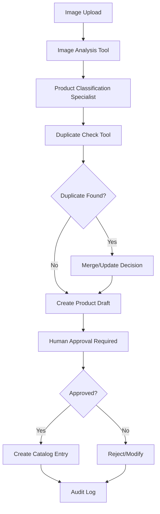

# Cataloging Workflow - Design & Implementation

## Overview

The Cataloging Workflow is the first implemented workflow in AutifyME, designed to automate the complete product cataloging process from raw images to approved catalog entries.

## Workflow Architecture

### High-Level Flow
```
Image Upload → Analysis → Classification → Deduplication → Human Approval → Catalog Entry
```

### Detailed Process Flow


## Component Architecture

### Three-Layer Implementation

#### 1. Tools Layer (Deterministic Functions)
- **ImageAnalyzer** (`src/tools/image/analyzer.py`)
  - Extracts product features from images using vision models
  - Returns structured `ProductFeatures` data
  - Handles API failures gracefully

- **SupabaseClient** (`src/tools/database/supabase_client.py`)
  - Manages all database operations
  - Implements multi-tenancy with business_id filtering
  - Provides audit logging for all operations

#### 2. Specialists Layer (Domain Expertise)
- **ProductClassificationSpecialist** (`src/specialists/content/product_classifier.py`)
  - Configurable multi-provider LLM support
  - Enhances product descriptions for SEO
  - Generates hierarchical category classifications
  - Creates relevant tags and keywords

- **DatabaseSpecialist** (`src/specialists/database/database_specialist.py`)
  - Intelligent database operations with AI-powered optimization
  - Multi-provider database support (Supabase, PostgreSQL, etc.)
  - Built-in caching and performance optimization
  - AI-powered duplicate detection and similarity search
  - Batch operations and trend analysis
  - Comprehensive audit logging

#### 3. Agents Layer (Orchestration)
- **CatalogingAgent** (To be implemented)
  - LangGraph workflow orchestration
  - State management across workflow steps
  - Human-in-the-loop approval handling
  - Error recovery and retry logic

## Technical Decisions & Rationale

### 1. Multi-Provider LLM Architecture
**Decision**: Implemented configurable LLM factory supporting OpenAI, Anthropic, Google, and Ollama

**Rationale**:
- Cost optimization through model tier routing
- Vendor independence and risk mitigation
- Automatic fallbacks for reliability
- Future-proofing for new providers

**Implementation**:
```python
# Cost-optimized model selection
specialist = ProductClassificationSpecialist(ModelTier.FAST)  # Uses cheapest suitable model

# Automatic provider fallback
llm = LLMFactory.create_with_fallback(ModelTier.BALANCED, requires_vision=True)
```

### 2. Domain-Separated Models
**Decision**: Split models into domain-specific files instead of monolithic structure

**Structure**:
```
src/core/models/
├── base.py              # System-wide models
├── cataloging.py        # Product-specific models
├── workflow.py          # Orchestration models
└── audit.py             # Compliance models
```

**Rationale**:
- Prevents large unmaintainable files
- Enables domain-focused development
- Easier to add new business domains

### 3. Absolute Import Pattern
**Decision**: Use absolute imports from project root

**Pattern**:
```python
from src.core.models.cataloging import ProductFeatures
from src.core.config import ModelTier
```

**Rationale**:
- Clearer dependency relationships
- Better IDE support and navigation
- Consistent across all modules

### 4. Database Specialist Architecture
**Decision**: Created dedicated Database Specialist instead of scattered database tools

**Implementation**:
```python
class DatabaseSpecialist(ConfigurableLLMMixin):
    # AI-powered database operations
    # Built-in caching and optimization
    # Intelligent duplicate detection
    # Batch processing capabilities
```

**Rationale**:
- Single responsibility for all database operations
- AI-powered query optimization and duplicate detection
- Reusable across multiple agents and workflows
- Provider abstraction for easy database switching
- Built-in performance optimization and caching

### 5. Async-First Database Operations
**Decision**: All database operations use async/await pattern

**Rationale**:
- Better performance for I/O operations
- Scalability for concurrent workflows
- Modern Python best practices

## Data Models

### Core Models

#### ProductFeatures
```python
class ProductFeatures(BaseModel):
    name: str
    category: Optional[str]
    color: Optional[str]
    material: Optional[str]
    brand: Optional[str]
    description: str
    tags: List[str]
```

#### ProductDraft
```python
class ProductDraft(BaseModel):
    id: str
    business_id: str
    features: ProductFeatures
    image_urls: List[str]
    confidence_score: float  # 0.0 to 1.0
    created_at: datetime
```

#### WorkflowState
```python
class WorkflowState(BaseModel):
    workflow_id: str
    business_id: str
    workflow_type: str = "cataloging"
    status: WorkflowStatus
    current_step: str
    data: Dict[str, Any]
    error_message: Optional[str]
```

## Database Schema

### Tables Implemented
- `business_profiles` - Multi-tenant business data
- `product_drafts` - Products awaiting approval
- `catalog_entries` - Approved products
- `workflow_states` - Process tracking
- `approval_requests` - HITL approvals
- `audit_entries` - Complete audit trail
- `cost_entries` - AI operation costs
- `performance_metrics` - System performance

### Key Features
- **Row Level Security (RLS)** for multi-tenancy
- **JSONB fields** for flexible product features
- **Vector support** for similarity search (pgvector)
- **Comprehensive indexing** for performance

## Configuration System

### LLM Configuration
```python
class LLMConfig(BaseModel):
    provider: LLMProvider  # openai, anthropic, google, ollama
    model_name: str
    cost_per_1k_tokens: float
    tier: ModelTier  # FAST, BALANCED, PREMIUM
    supports_functions: bool
    supports_vision: bool
```

### Cost Optimization
- **Tier-based routing**: Simple tasks → FAST models, Complex → PREMIUM
- **Automatic fallbacks**: Provider failure → Next cheapest option
- **Budget controls**: Daily spending limits and token caps

## Implementation Progress

### ✅ Completed Components

#### Phase 1: Foundation (Completed)
- [x] Project structure and configuration
- [x] Domain-separated data models
- [x] Multi-provider LLM factory
- [x] Centralized credential management system
- [x] Database specialist with AI-powered operations
- [x] Database schema and client
- [x] Image analysis tool
- [x] Product classification specialist

#### Current Status: **Phase 1 Complete**

### 🚧 In Progress

#### Phase 2: Agent Implementation (Next)
- [ ] Cataloging agent with LangGraph
- [ ] Workflow state management
- [ ] Human-in-the-loop approval system
- [ ] Error handling and retry logic

### 📋 Planned Components

#### Phase 3: Integration & Testing
- [ ] End-to-end workflow testing
- [ ] Performance optimization
- [ ] Cost monitoring dashboard
- [ ] API endpoints for external access

#### Phase 4: Production Features
- [ ] Batch processing capabilities
- [ ] Advanced duplicate detection
- [ ] Image enhancement pipeline
- [ ] Analytics and reporting

## Quality Assurance

### Error Handling Strategy
- **Graceful degradation**: Always return structured responses
- **Fallback mechanisms**: Default values when AI fails
- **Audit logging**: All errors logged with context
- **Retry logic**: Automatic retries with exponential backoff

### Testing Approach
- **Unit tests**: Individual tools and specialists
- **Integration tests**: Database and API interactions
- **End-to-end tests**: Complete workflow validation
- **Load tests**: Performance under concurrent load

## Performance Considerations

### Optimization Strategies
- **Model caching**: 24-hour cache for similar requests
- **Batch processing**: Group similar operations
- **Connection pooling**: Efficient database connections
- **Async operations**: Non-blocking I/O throughout

### Monitoring Metrics
- Workflow completion time
- AI model costs per operation
- Database query performance
- Error rates by component

## Security & Compliance

### Data Protection
- **Multi-tenancy**: RLS ensures data isolation
- **Audit trail**: Immutable log of all operations
- **API key security**: Environment variable management
- **PII handling**: Minimal data collection and storage

### Compliance Features
- **GDPR support**: Data deletion capabilities
- **Audit requirements**: Complete operation tracking
- **Cost transparency**: Detailed cost breakdown per operation

## Future Enhancements

### Planned Improvements
1. **Advanced AI Features**
   - Multi-modal analysis (text + image)
   - Custom model fine-tuning
   - Automated quality scoring

2. **Integration Capabilities**
   - E-commerce platform connectors
   - Inventory management systems
   - Marketing automation tools

3. **Analytics & Intelligence**
   - Product performance predictions
   - Market trend analysis
   - Automated pricing recommendations

## Lessons Learned

### Architectural Insights
1. **Configuration-driven design** enables rapid provider switching
2. **Domain separation** prevents model files from becoming unwieldy
3. **Async-first approach** essential for scalable workflows
4. **Multi-provider support** critical for cost optimization and reliability

### Development Best Practices
1. **Start with simple, working implementations**
2. **Build error handling from the beginning**
3. **Use framework patterns instead of custom solutions**
4. **Document decisions as you make them**

---

## Next Steps

1. **Implement CatalogingAgent** using LangGraph
2. **Add comprehensive error handling**
3. **Create approval interface**
4. **Build end-to-end tests**
5. **Deploy MVP for testing**

---

*Last Updated: 2025-09-01*
*Current Phase: Foundation Complete, Agent Implementation Next*